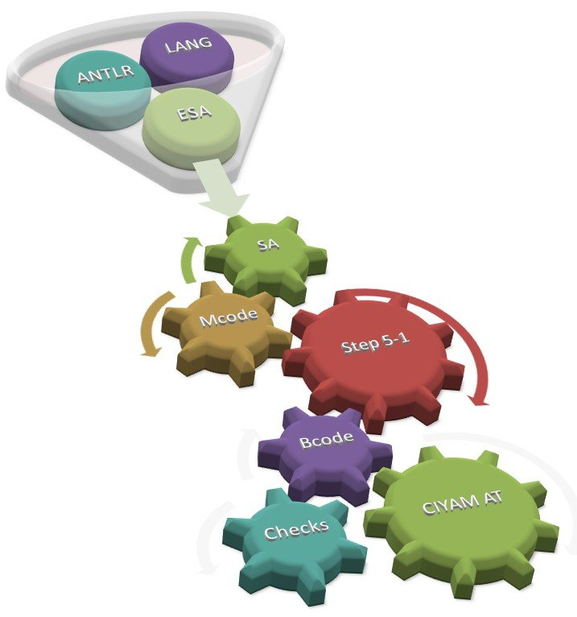

Introduction
------------

BlockTalk is an extended BURST AT framework which aids in the creation and deployment of ATs via a simple and concise language, and a simple interface for deploying to the blockchain. It includes tools and code snippets to assist in the process, and helps manage the minimal fees involved with running ATs.

### Vision

The vision of BlockTalk is to have a state-of-the-art and easy to deploy framework for smart contracts. The project decision was to make use of Java as the first high-level language to implement this framework. Although the project is already underway, anyone who like to join the project is welcome and should send a contact request to frank_the_tank on discord. 

For more information on BlockTalk, see [CIP20](https://github.com/burst-apps-team/CIPs/blob/activate-cip20/cip-0020.md).

System Design
-------

### LANG
This will be a new programming language, specifically designed for future creation of AT

### ANTLR ([Another Tool for Language Recognition](https://www.antlr.org))
This is a powerful tool for reading and translating structured text into binary files. That involves:

* A Lexer – to read LANG sourcecode and turn that into tokens
* A parser – to parse and turn the tokens into a structured representation (AST)
* AST – with an associated walker to walk the AST and turn that into a new extended script language (ESA) for Burst blockchain

### ESA
The extended script assembly (ESA) will create and handle the new types, dynamic memory and extension of SA.

### SA
The script assembly is creating the first maschinencode.
It includes and handles logical branches, declarations of vars, labels to jump to, named API funcs as opposed to hex numbered functions.

### Mcode
This module make the preparation for the Step5-1 processing.
Mainy labels will be swapped out with addrs, named funs swapped with hex numbered func, named vars swapped with their physical addrs.

### Step5-1
The steps are part of the compiling process.
The steps compile mcode into bcode and breaks that task into clearly defined steps of 5. Each step, involves having input from step above and providing output to step below. Syntax and semantics are thoroughly checked on both input and output at each step. In case of any error at a given step, the input is rejected and an error message to the above step is submitted. Step3 is the most human readable (big-endian), Step2 and Step1 are on form little-endian.

### Bcode
Final transformation to bytecode.
Each instr on separate lines, as op-funcno-arg , literal

### CIYAM Bytecode
In this last step some checks will be performed with the bytecode and CIYAM Bytecode will be created. This code can then be released to the BURST-Chain as a new smart AT.

API Integrations
--------------

### burstkit4j : [API Calls](https://github.com/burst-apps-team/burstkit4j/commit/8c216d1c21976d95588bc0e94d14c2f864b1e606) and [integration](https://github.com/jjos2372/blocktalk/commit/4887ca219407b3165b2f6c1beb956a78aac74bf4)

Example
-------
This [example of NFT](https://github.com/jjos2372/blocktalk/blob/master/src/main/java/bt/sample/UniqueToken.java) on github shows BlockTalk handling AT owner changes. Only the current owner can set a price in BURST for which the NFT-AT can be sold. The first user who sends the set account to the AT will be the new owner.

With this simple and clean contract we are already in a position to build NFTs like CryptoKitties or items for the gaming industry or any other business case where unique Tokens are needed.

What are NFTs?
------------

NFTs ([non-fungible-tokens](https://en.wikipedia.org/wiki/Non-fungible_token)) are basically new and unique representations of goods or assets that take the form of digital tokens/AT. Through the use of cryptography, NFTs can prove the authenticity, as well as ownership of such assets and goods.

Let's say that there is a virtual artwork that is tokenized. With that in mind, whoever holds the tokens, acts as the direct owner of the piece of art itself. Obviously, NFTs are quite unique, and no other item can replace them. The possible implications of this are many, and they might even create an entirely new class of digital assets in the future. It is even possible that real-world items and assets might be this closely tied to digital tokens, all with the goal of securing the ownership of such items. The NFTs were brought to the mainstream together with CryptoKitties. This is a concept that gained a lot of popularity near the end of the previous year. Some of them were so popular, that they were priced and sold for hundreds of thousands of dollars.

References
----------

1. [https://www.burstcoin.ist/2019/04/06/blocktalk-the-new-smart-way-for-burst-ats/](https://www.burstcoin.ist/2019/04/06/blocktalk-the-new-smart-way-for-burst-ats/)

2. [https://www.reddit.com/r/burstcoin/comments/bi26xi/blocktalk_introduce_nftnonfungibletoken/](https://www.reddit.com/r/burstcoin/comments/bi26xi/blocktalk_introduce_nftnonfungibletoken/)

3. [https://github.com/burst-apps-team/CIPs/blob/activate-cip20/cip-0020.md](https://github.com/burst-apps-team/CIPs/blob/activate-cip20/cip-0020.md)
