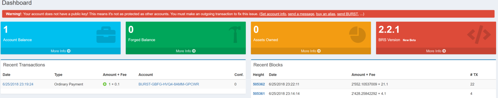
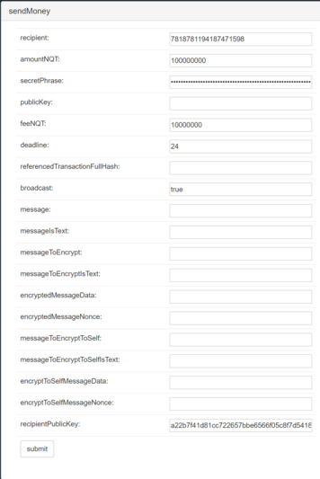
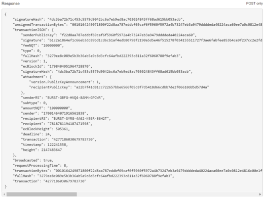

Introduction
------------

Activating a Burst account simply means “propagating” the publicKey of your account to the rest of the network. The common way to do so is simply by creating an outgoing transaction ([Reward Assignment](reward-assignment.md), setting an [Alias](alias-system.md), etc.).

It is a necessary step in order to ensure that your account is secured. Indeed, two different passphrases can produce the same BURST addresses (see [RS Address Format](rs-address-format.md)).

Activate your wallet using the Burst Interface
----------------------------------------------

When you log into your new account and if you already received 1 Burst, this message appears:

You can click on “Set account info”, “send a message”, “buy an alias” or “send BURST” to create an outgoing tx and share your publicKey to the rest of the network.

Activate your wallet using the API
----------------------------------

Another less known way to activate your wallet is using the Burst API. You won't even need to make an outgoing tx from your new account using this method, because you can directly specify the recipient publicKey in the outgoing tx on the account you're using.

Firstly, please visit <https://127.0.0.1:8125/test?requestType=sendMoney> or <https://voiplanparty.com:8125/test?requestType=sendMoney> or any trusted online wallet of your choice.

You need to fill the following fields :

- **recipient** : type the numeric id of the recipient (the account you want to activate)

- **amountNQT** : type 100000000 (= 1 BURST)

- **secretPhrase** : type your passphrase

- **feeNQT** : type the fee your willing to pay (10000000 in this example, 0.1 BURST)

- **deadline** : type 24 (hours)

- **broadcast** : true (broadcast the transaction to the rest of the network)

- **recipientPublicKey** : type the publicKey (lowercase) of the recipient (the account you want to activate). This information is available using the getAccountId API call. Simply type the passphrase of the account you want to activate.

If everything went well, you should have the following response :

Congratulations ! Your new account is activated without making an outgoing tx from it !

For more informations, take a look at [The Burst API](the-burst-api.md) and [The Burst API Examples](the-burst-api-examples.md).
