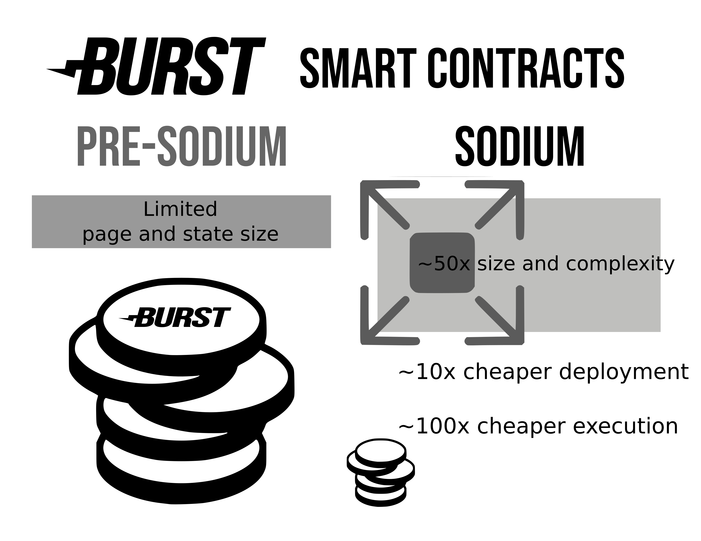

Burstcoin *SODIUM* Hard Fork: Technical Details
=======

*Burstcoin is the ****pioneer of the “Proof of Capacity”**** consensus algorithm, a green alternative to Proof of Work. First developed in 2014, Burst has been at the forefront of blockchain technology with the first implementation of smart contracts. Since 2019, the Burst Apps Team has been preparing the Burst blockchain for the next decade. ****Increasing speed, stability and functionality****, a new software version combined with an upcoming hard fork will solidify Burst once again as a next-generation cryptocurrency.*

## Summary

- On May 10, 2020, BRS 2.5 (Java) will be released. **It is imperative that node operators upgrade to support the updated consensus protocol**, *SODIUM*.
- Around June 20, 2020, the Burst blockchain will hard fork at block 765,000.
- Includes improvements CIP 20, 22, 23, 24 and 25.
- Second half of 2020, BRS 3.0 (a Kotlin rewrite) will be released.

## *SODIUM*

Around the 20th of June 2020, active nodes running the Burst Apps Team’s Burst Reference Software (BRS) will automatically participate in a fork of the Burst blockchain, codenamed *SODIUM*. *SODIUM* will be released in a dormant state in BRS 2.5.0 and activated on Block 765K, which will unlock new platform-wide features, better performance, and security improvements. 

The first release, BRS version 2.5.0, will be released the **10th of May**, and will contain all of the protocol changes which will automatically activate around the **20th of June at blockheight 765K**. In order to ensure a successful fork, it is imperative that node operators **upgrade to BRS 2.5.0 as soon as possible**.

### Protocol Changes

The hard fork contains a set of modifications to the Burst protocol. While the API updates detailed in CIP 22 contains no breaking changes, these changes will expand the ability for miners and nodes to operate within the network. 

The advancements in CIP 20, 23, 24, and 25 represent breaking changes to the Burstcoin consensus protocol, which will result in a hard fork once enabled. To address easy community adoption, a plan has been developed which involves the release of two new versions of BRS.

The CIP details are included at the end of this report.

### Our Approach: Two-Staged Release

For the past year, a lot of work has been done to create a new BRS version 3.0, while also adding major features and improvements to version 2.5.0. To ensure stability of the network the HF will be performed on the original Java codebase. Followed by the release of BRS 3.0.

BRS 3.0 is a practical rewrite of the underlying software. In a migration from Java to Kotlin, it represents the future. From a risk management perspective, tying its release to a hard fork would not be prudent, it is imperative to keep critical infrastructure stable. 

### Stage 1: BRS 2.5 - Java

Enter BRS 2.5.0, which is the existing Java 8 BRS codebase, plus the protocol changes comprising *SODIUM*. Including all fixes, CIP updates and hard fork protocol changes. BRS 2.5.0 has been thoroughly fork-tested on Testnet independently, and in conjunction with BRS 3.0, to simulate both normal and failover scenarios.

Below a diagram illustrating the release plan:

**Community adoption of the new BRS version 2.5.0 is essential to ****SODIUM****’s success**. To achieve timely consensus before the hard fork block height. So please spread the word! 

### Stage 2: BRS 3.0 - Kotlin

To be released in the second half of 2020, BRS 3.0, created by Harry1432, brings more major improvements to BRS in terms of architecture, performance, and user experience.

#### Improved Architecture

BRS has been rewritten in the Kotlin programming language to prepare it for the future, leaving the old Java 8 software behind. BRS 3.0 opens up new possibilities, and makes it easier to deploy on any platform and hardware architecture. 

#### Performance Improvements

BRS 3.0 is much faster and more efficient than prior BRS versions. Running a BRS 3.0 node will be easier and more energy-efficient than ever before. BRS 3.0 represents years of hard work toward our vision of making Burstcoin even more green, while staying truly decentralised.

#### UI Overhaul

Phoenix, an open source cross-platform Burst Wallet UI, will be the default wallet UI in BRS 3.0. Phoenix provides multiple account management, improved security, and better interoperability. Phoenix makes it very easy to integrate Burstcoin in projects and webshops for quick and easy payments. For users who still want to use the legacy UI, a link will be provided to it, which will ship alongside Phoenix in BRS 3.0.

### Protocol Change Details

#### Smart Contract Upgrade (CIP20)
Author: jjos

Smart contracts (Automated Transactions) have become an increasingly important feature for next generation financial technology. The Burstcoin blockchain now has the ability to run larger and more complex smart contracts with lower fees. Combined with the BlockTalk Java smart contract compiler, these changes bring the creation of new trustless projects (DeFi, Non-Fungible Tokens, DEXs, Games, etc), which were before unimaginable, within reach.

#### Burst Deep Link Specification (CIP 22)
Author: ohager

This specification of deep linking within the Burst eco-system simplifies the interoperability between Burst applications. It permits that the feature-rich platform can be splitted in different specialized applications, i.e. asset exchange, simple wallet, messaging application, while maintaining an integrated user-experience. It is even possible to create "meta-applications", which serves as a container for those applications.

#### Fee Slot Enforcement (CIP23)
Author: CurbShifter

In relation to CIP03, the slot-based transaction fee system allows for variable fees depending on the transaction load on the blockchain. As a secondary goal it prevents spamming blocks with lots of transactions with minimum fees. However the block validation did not strictly enforce these minimum fees used relative to the slot number. 

With CIP23 enabled, validating a block will check the fee amounts of all transactions to ensure these fees conform to the minimum. Otherwise the block will be deemed invalid. This change also implies the removal of fat forging blocks where all fees are disregarded. Which caused an unenforceable and unbalanced distribution of fees among the blocks and their miners.

#### Blocktime Stabilization (CIP24)
Author: jjos

The deadline computation and block time control currently implemented on Burstcoin provides nearly perfect average block times of 4 minutes. However, as currently implemented, individual block times still show a broad variation with individual block times ranging typically from 10 up to 2000 seconds. With the CIP24 protocol upgrade, this can be much reduced, with block times ranging from 100 to 360 seconds. There is no change on the expected (average) value of 240 seconds (4 minutes) and mining software can be left unchanged.
 

#### Subscription Fee Reduction (CIP25)
Author: Harry1432

When the new fee model was introduced with CIP03, the execution costs of a subscription were not adjusted. The fees for subscriptions still remained at 1 burst per subscription payment. This change makes the fee for a subscription payment 0.00735 Burst.

## Conclusion

BRS 2.5 and 3.0 together represent over a year’s worth of work. Through rigorous testing, reviews, and iterations, the Burst Apps Team has been preparing for this event for months. They are proud of the results, and are excited to work with the community on the successful deployment of this and future hard forks.

The *SODIUM* HF checklist for the Burst community is available at https://burstwiki.org

If you have any questions, comments, or concerns, we encourage you to reach out to us via

- Discord: https://discord.gg/ag4qK83
- Twitter: https://twitter.com/BurstAppsTeam
- Github: https://github.com/burst-apps-team